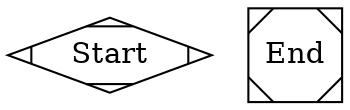
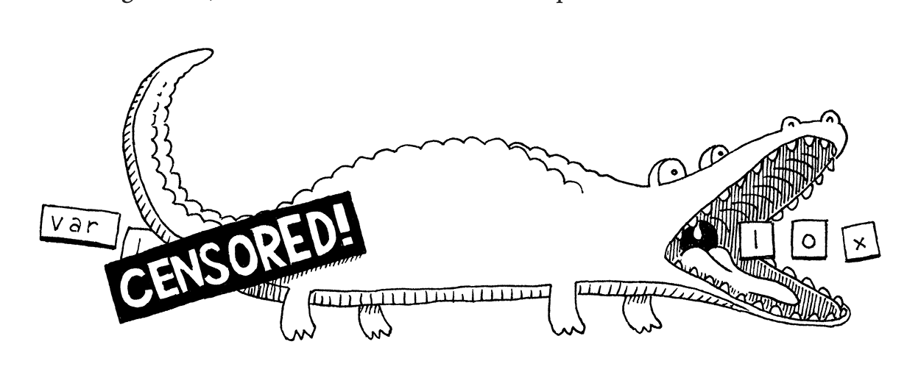

# Kassi - Program 3 Report

## Updates

### BNF Rules

In this iteration, I updated the BNF rules of `FlowScript`. The goal was to make them simpler and shorter. Below are the following changes that I made.

#### Removed the `Start` and `End` Nodes 

In previous iteration of the BNF rules, I said that all FlowScript programs should start at `Start` node and end at a `End` node.



In this iteration, I am ditching this rule. This rule was introduced purely for aesthetic reasons, no practically purposes. The result of this action is that this removes the following types of statements from `FlowScript`'s BNF rules:

- `<StartPoint>`
- `<EndPoint>`

#### Removed clutter in the `FunctionDeclaration` rule

I decided to ditch the color and label attribute when declaring a subgraph (i.e. a function) in `FlowScript`. In the previous iteration of the BNF rules, the `<FunctionDeclaration>` production looked like this:

```bnf
<Function> ::= "subgraph" <VariableIdentifier> "{" 
                  "node" "[" "style=filled" "]" ";" 
                  "edge" "[" "style=dashed" "]" ";" 
                  (<JobDeclaration> | <Dependency>)* 
                  "label" "=" <String> ";" 
                  "color" "=" "blue" ";" 
              "}"
```
Now, it looks like this:

```bnf
<FunctionDeclaration> ::= "subgraph" <IDENTIFIER> "{" 
                      (<Declaration>)* 
                  "}"
```

It's simpler, and makes it easier to parse. Also removing those statements does not make it harder for the user to distinguish between standalone jobs and "functions", which are just job chains. Jobs feeding on each other's output.

**NOTE: I renamed the rule, and chose a name I thought was more descriptive**.

#### Updated the `dependency` production

As a recall, this rule is used to express dependencies between jobs the user have created. In the previous iteration of the BNF rules, the `<Dependency>` production look like this:

```bnf
<Dependency> ::= <VariableIdentifier> "->" <VariableIdentifier> ";"
```

Now, it looks like this:

```bnf
<Dependency> ::= <IDENTIFIER> "->" <IDENTIFIER> ( "->" <IDENTIFIER> )* ";"
```

The updated version of the rule is slightly more complex, but is more robust. This version handles dependency chains (involving more than two jobs) like:

```txt
A -> B -> C -> D -> E;
```
which was not possible in the previous version of the rule.

#### Introduced a `primary` production

#### Made the distinction between a `Declaration` and a `Statement`

With all the previously mentioned updates, the BNF rules for `FlowScript` look like this:

```bnf
<FlowScript> ::= "digraph" "FlowScript" "{" <Declaration>* EOF "}"

<Declaration> ::= <VarDeclaration> | <FunctionDeclaration> | <JobDeclaration> | <Statement>

<Statement> ::= <Dependency> | <Conditional> | <Comment>

<JobDeclaration> ::= <IDENTIFIER> "[" "jobType" "=" <STRING> "shape" "=" "circle" "input" "=" <IDENTIFIER> "]" ";"

<VariableDeclaration> ::= <IDENTIFIER> "=" <Primary> | <IDENTIFIER> ";"

<FunctionDeclaration> ::= "subgraph" <IDENTIFIER> "{" 
                      (<Declaration>)* 
                  "}"

<Dependency> ::= <IDENTIFIER> "->" <IDENTIFIER> ( "->" <IDENTIFIER> )* ";"

<Conditional> ::= <IDENTIFIER> "[" "jobType" "=" "logical_conditional" "testType" "=" <String> "if_true" "=" <IDENTIFIER> "else" "=" <IDENTIFIER> "label" "=" <String> "shape" "=" "diamond" "]" ";"

<Block> ::= "{" <Declaration>* "}"

<Primary> ::= <NUMBER> | <STRING> | <IDENTIFIER> | "nil"

<IDENTIFIER> ::= (letter | "_") (letter | digit | "_")*

<Comment> ::= "//" any sequence of characters until end of line

<String> ::= any sequence of characters WITHIN double quotes
```

## Overview of the `FlowScript` interpreter

This is the meat 🍗🥩 of the report. I will try best to be as thorough as possible. I will go through the compilation process and explain how each part was achieved.

**NOTE: The source code of the interpreter is located in the `Code/fs_interpreter` folder**.

For this lab, the interpreter was written as a standalone Python script, and the entry point of the program is the `flowscript.py` file. In the file, the function that kicks of the interpreter itself is the run function, and it looks like this:

```py
def run(source: str):
    lexer = scanner.Scanner(source)
    tokens = lexer.scan_tokens()

    parser = fsParser.Parser(tokens)
    statements = parser.parse()

    if FlowScript.had_error:
        return
    
    if len(statements) == 0:
        return
    
    # for token in tokens:
    #     print(token)

    # At this point, the parser have IDENTIFIED All TYPE of statements the user have typed,
    # Now, it is the responsibility of the interpreter to 'execute' those statements.
    interpreter = Interpreter()
    interpreter.interpret(statements)
```

Let's go over each step together.

### Scanning

The first step in the compilation process of a `FlowScript` code is **scanning**, and the part of the interpreter in charge of "scanning 👀" the source code is the **lexer** which is short for lexical analyzer. The goal of the "scanning" step is to turn the source code which is a raw string into a series of **tokens**. The `FlowScript` lexer achieves this by grouping relevant characters together. Simply put, here is a nice illustration showing what the `FlowScript` lexer does.



Each blob of characters formed by the lexer is called a **lexeme**. In the process of forming those "lexeme" the `FlowScript` lexer also include additional information such as the line number. The lexeme, the line number, plus any other data gathered by the lexer is what is considered a **Token**. For instance, here the definition of a `Token` in `FlowScript`:

```py
class Token:
    def __init__(self, type: TokenType, lexeme: str, literal: object, line: int) -> None:
        self.type = type
        self.lexeme = lexeme
        self.literal = literal
        self.line = line

    def __str__(self) -> str:
        return f"{self.type}, {self.lexeme}, {self.literal}"
```

Each detected token has a:
- **Type** which tells which kind of token it is. Since FlowScript has keywords, we must different between them and identifiers created by the users.
- **Lexeme** which is the raw substring in the source code
- **Literal** which is the actual value of the token. For instance we may encounter a string representing a number. The literal will be numerical representation of the number.
- **Line**: Which is where in the source code this token was detected.

**NOTE**: You can find the different types of tokens FlowScript supports int he `tokentype.py` file.

**NOTE**: The lexer of the `FlowScript` programming language is implemented in the `scanner.py` file, inside the `fs_interpreter` folder, which itself is within the `Code` folder.

### Parsing

After scanning, the source code is no longer is a series of characters, but rather a flat list of tokens. For instance, the following FlowScript code (available in the `Data` folder under the `FlowScript` folder):

```dot
digraph FlowScript {
    compile_input = "{\"jobChannels\": 268435456, \"jobType\": 1, \"makefile\": \"./Data/testCode/Makefile\", \"isFilePath\": true}";
    parsing_input = "{\"jobChannels\": 536870912, \"jobType\": 2, \"content\": \"\"}";

    A[jobType="COMPILE_JOB" shape=circle input=compile_input];
    B[jobType="PARSING_JOB" shape=circle input=parsing_input];

    A -> B;
}
```



is turned into this series of Tokens:

```py
TokenType.DIGRAPH, digraph, None
TokenType.FLOWSCRIPT, FlowScript, None
TokenType.LEFT_BRACE, {, None
TokenType.IDENTIFIER, compile_input, None
TokenType.EQUAL, =, None
TokenType.STRING, "{\"jobChannels\": 268435456, \"jobType\": 1, \"makefile\": \"./Data/testCode/Makefile\", \"isFilePath\": true}", {"jobChannels": 268435456, "jobType": 1, "makefile": "./Data/testCode/Makefile", "isFilePath": true}
TokenType.SEMICOLON, ;, None
TokenType.IDENTIFIER, parsing_input, None
TokenType.EQUAL, =, None
TokenType.STRING, "{\"jobChannels\": 536870912, \"jobType\": 2, \"content\": \"\"}", {"jobChannels": 536870912, "jobType": 2, "content": ""}
TokenType.SEMICOLON, ;, None
TokenType.IDENTIFIER, A, None
TokenType.LEFT_BRACK, [, None
TokenType.JOB_TYPE, jobType, None
TokenType.EQUAL, =, None
TokenType.STRING, "COMPILE_JOB", COMPILE_JOB
TokenType.SHAPE, shape, None
TokenType.EQUAL, =, None
TokenType.CIRCLE, circle, None
TokenType.INPUT, input, None
TokenType.EQUAL, =, None
TokenType.IDENTIFIER, compile_input, None
TokenType.RIGHT_BRACK, ], None
TokenType.SEMICOLON, ;, None
TokenType.IDENTIFIER, B, None
TokenType.LEFT_BRACK, [, None
TokenType.JOB_TYPE, jobType, None
TokenType.EQUAL, =, None
TokenType.STRING, "PARSING_JOB", PARSING_JOB
TokenType.SHAPE, shape, None
TokenType.EQUAL, =, None
TokenType.CIRCLE, circle, None
TokenType.INPUT, input, None
TokenType.EQUAL, =, None
TokenType.IDENTIFIER, parsing_input, None
TokenType.RIGHT_BRACK, ], None
TokenType.SEMICOLON, ;, None
TokenType.IDENTIFIER, A, None
TokenType.ARROW, ->, None
TokenType.IDENTIFIER, B, None
TokenType.SEMICOLON, ;, None
TokenType.RIGHT_BRACE, }, None
TokenType.EOF, , None
```

The parser will now go through all of these tokens, and recognize the different types of statements that one can form in `FlowScript`. The parser will go on and detect statements like.

- Job Declaration statements
- Dependency relationship statements
- Variable declarations statements
- Variable assignments statements
- Block statements which can be any combination of the above statements

Simply put, the parser implements the **BNF** rules of `FlowScript`. And the technique the `FlowScript` employed to achieve the parsing is called **Recursive descent**. Though the technique is simple is was more than sufficient for this instance.

Interestingly, using recursive descent did not require using complex parser generator tools like Yacc, Bison, or ANTLR. Despite its simplicity, the recursive descent parsers are fast, robust, and are great for error handling, as you will soon see. If the FlowScript interpreter was implemented in C++ we would appreciate its speed better. But for simplicity and sanity purposes, I decided to use Python, which makes it easy to write, but also explain the code like I am doing right now.

But the main reason why I was encouraged to use a implement a recursive descent parser is because this parsing technique in multiple heavyweight production language implementations like GCC, V8(the JavaScript VM in Chrome), Roslyn( the C# compiler).

The FlowScript parser falls into the category of a **top-down parser** because it starts from the top BNF rule, and words its way down into the nest rules, before reaching the leafs (or the terminal) rules. Because of this nature, implementing the BNF rules in the parser was straightforward. 

The parser is implemented in the `fsParser.py` file. And the recursive descent starts is implemented in the `parse` function and looks like this:

```py
def parse(self):
    statements = []

    # This is the program entry point. It is also the beginning of the recursive descent.
    if self.match(TokenType.DIGRAPH):
        statements.append(self.flow_script_entry_point())
    else:
        print("Malformed entry point")
    return statements
```

By the time the parsing the process ends, `statement` contains all types of statements and expressions that the user wrote. Spoiler, this array contains only 1 element. This is element is of type:

```py
<class 'Stmt.Block'>
```
And it's easy to see why because the entire FlowScript program is in a `digraph` statement like this:

```txt
digraph FlowScript {
    // Your statements comes here
}
```

And since the parser is recursive, this "Block" statement is the 'tip' of the syntax FlowScript Abstract Syntax Tree( AST ). If we were to traverse it, we would recursively find other type of statements inside this `Block` statement. We could even find `Block` within statements.

### Interpretation and execution of statement

This is the last part of the process and is acheived by the two little lines below:

```py
interpreter = Interpreter()
interpreter.interpret(statements)
```

The interpreter grabs the statement produced by the parser, and recursively traverse it. The code for the interpreter is within the `interpreter.py` file. The heart of the interpreter is this function:

```py
def interpret(self, statements: List[Stmt.Stmt]):
    self.total = len(statements)
    try:
        for statement in statements:
            self.execute(statement)

        # Move jobs from the staging area to the job system.
        self.schedule_jobs()
    except runtimeError as error:
        flowscript.FlowScript.runtime_error(error)
```
See how statements statements are recursively visited and "executed". I put "executed" between quotes because the interpreter does not immediately execute statements as soon as it sees them. Instead it processes them and move them a "staging area". This staging area is a data structure associating a unique identifier with the information of each job when the interpreter processed them.

When all the statements in the code have been processed, then they are all scheduled in bulk on the job system. During this scheduling process, is where the execution chain is created.

Since all the statements are examined by the interpreter before being executed on the job system, this interpreter falls into the **second approach**.

As soon as the job are submitted, the interpreter gives you the hand 👋, through an interactive program you can see your jobs in the job system, and query their status, and finish them yourself if need be.

## Error detection and handling

Now, let's talk about some error handling. Earlier, I said that recursive descent parsers were good at handling errors. Let's demonstrate some of that. For purpose of demonstration, I put together some example FlowScript code in the `FlowScript` folder inside the `Data` folder of this repository

On my machine, inside the repository, precisely in the ... folder I was able to run the flowscript interpreter using the following command:

```sh
python Code/fs_interpreter/flowscript.py ./Data/FlowScript/<file_name>.fscript
```

### Syntax errors

The interpreter can detect syntax error. A syntax error here occurs when the user:

- forgets a semicolon at the end of a statement
- Does not initialize a variable.
- Initialize a variable with anything other than a string
- reassign a variable with another variable that does not exist
- Reuse job identifiers.
- Forget an opening or closing brace or brackets

Let's consider the `variables.fscript` file which showcases variables usage:

```txt
digraph FlowScript {
  var_1 = "TEST"
  var_2 = var_1;
}
```
Removing a semicolon at the end of `var_1 = "TEST";` yields the following error:

```txt
[line 2] Error at '"TEST"': Expect ';' at the end of statement
```

**NOTE**: After the errors is displayed, Python also displays the stack trace. You might have to scroll up a little bit before seeing the error from the FlowScript interpreter itself.

If you fix, the semicolon but forget to put `FlowScript` which is, in the case of FlowScript, the equivalent of a main function you get this error:

```txt
[line 1] Error at 'digraph': The entry point of FlowScript should be named 'FlowScript', you wrote {
```

if you remove the line `var_1 = "TEST"`, and run the following code:
```txt
digraph FlowScript {
  var_2 = var_1;
}
```

you get this error:

```txt
[Line: 2]: Undefined variable 'var_1'.
```

Let consider another `dependency.fscript` file. It looks like this:

```txt
digraph FlowScript {
    compile_input = "{\"jobChannels\": 268435456, \"jobType\": 1, \"makefile\": \"./Data/testCode/Makefile\", \"isFilePath\": true}";
    parsing_input = "{\"jobChannels\": 536870912, \"jobType\": 2, \"content\": \"\"}";

    A[jobType="COMPILE_JOB" shape=circle input=compile_input];
    B[jobType="PARSING_JOB" shape=circle input=parsing_input];

    A -> ; // ERROR HERE - A DEPENDENCY STATEMENT MUST INVOLVE TWO IDENTIFIERS
}
```

running this gives you the following error:

```txt
[line 10] Error at '->': Expect target identifier in dependency
```

FlowScript requires that job identifier are unique. If you try to reuse the same identifier, the parser will not allow it. Consider this for instance:

```txt
digraph FlowScript {
    compile_input = "{\"jobChannels\": 268435456, \"jobType\": 1, \"makefile\": \"./Data/testCode/Makefile\", \"isFilePath\": true}";
    parsing_input = "{\"jobChannels\": 536870912, \"jobType\": 2, \"content\": \"\"}";

    A[jobType="COMPILE_JOB" shape=circle input=compile_input];
    A[jobType="PARSING_JOB" shape=circle input=parsing_input];
}
```

If you try to run a FlowScript like that, you get this error:

```txt
[Line: 6]: Identifier 'A' is being reused. Identifiers must be unique
```

If you forget to open/close a bracket or a brace the parser will also let you know. Running this code:

```txt
digraph FlowScript // MISSING OPENING BRACE 
  var_1 = "TEST";
  var_2 = var_1;
}

```
yields the following error:

```txt
[line 1] Error at 'FlowScript': Opening brace expected
```

### Runtime error

A runtime error occurs when an error was not caught at compile time. Let's consider the same `dependency.fscript` file. Imagine that instead of the providing a valid JSON as input, we provided just an invalid JSON string like so:

```txt
// FlowScript Showcasing variable usage

digraph FlowScript {
    compile_input = "INVALID JSON";
    parsing_input = "{\"jobChannels\": 536870912, \"jobType\": 2, \"content\": \"\"}";

    A[jobType="COMPILE_JOB" shape=circle input=compile_input];
    B[jobType="PARSING_JOB" shape=circle input=parsing_input];

    A -> B;
}
```

This is valid to the eyes of the FlowScript parser, but is not valid to the eyes of the interpreter who has to interact with the job system. If you try to run the above FlowScript the interpreter will yell at you with this:

```txt
[Line: 7]: The input of job 'A' must be a valid JSON string
```

The error says line 7 because when the interpreter tries to resolve `compile_input` it notices that it is not a valid `JSON`, so it cannot submit that job to the job system.

I only showed one example, because at the time I am writing this, I am rushing against the clock, and if you look at the last commit will see.

## Limitations

- As of now, one cannot reuse functions in other `FlowScript` in other parts of the same file, or in other files. However, implementing this functionality should involve minimal additional work considering the foundations that have been lay out during this lab.

- As of now, there are no built-in checks to prevent the users to create a circular dependency.

- As of now, there are no built-in checks to prevent the users to create self-dependencies. Meaning there is nothing preventing the user from telling the interpreter that the job is dependent on itself. Thus the following statement should not be allowed.

```txt
A -> A
```

ALL of the limitations mentioned above will be addressed in the next iteration of the FlowScript interpreter.