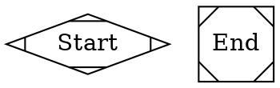

# Kassi - Program 3 Report

## Updates

### BNF Rules

In this iteration, I updated the BNF rules of `FlowScript`. The goal was to make them simpler and shorter. Below are the following changes that I made.

#### Removed the `Start` and `End` Nodes 

In previous iteration of the BNF rules, I said that all FlowScript programs should start at `Start` node and end at a `End` node.



In this iteration, I am ditching this rule. This rule was introduced purely for aesthetic reasons, no practically purposes. The result of this action is that this removes the following types of statements from `FlowScript`'s BNF rules:

- `<StartPoint>`
- `<EndPoint>`

#### Removed clutter in the `FunctionDeclaration` rule

I decided to ditch the color and label attribute when declaring a subgraph (i.e. a function) in `FlowScript`. In the previous iteration of the BNF rules, the `<FunctionDeclaration>` production looked like this:

```bnf
<Function> ::= "subgraph" <VariableIdentifier> "{" 
                  "node" "[" "style=filled" "]" ";" 
                  "edge" "[" "style=dashed" "]" ";" 
                  (<JobDeclaration> | <Dependency>)* 
                  "label" "=" <String> ";" 
                  "color" "=" "blue" ";" 
              "}"
```
Now, it looks like this:

```bnf
<FunctionDeclaration> ::= "subgraph" <IDENTIFIER> "{" 
                      (<Declaration>)* 
                  "}"
```

It's simpler, and makes it easier to parse. Also removing those statements does not make it harder for the user to distinguish between standalone jobs and "functions", which are just job chains. Jobs feeding on each other's output.

**NOTE: I renamed the rule, and chose a name I thought was more descriptive**.

#### Updated the `dependency` production

As a recall, this rule is used to express dependencies between jobs the user have created. In the previous iteration of the BNF rules, the `<Dependency>` production look like this:

```bnf
<Dependency> ::= <VariableIdentifier> "->" <VariableIdentifier> ";"
```

Now, it looks like this:

```bnf
<Dependency> ::= <IDENTIFIER> "->" <IDENTIFIER> ( "->" <IDENTIFIER> )* ";"
```

The updated version of the rule is slightly more complex, but is more robust. This version handles dependency chains (involving more than two jobs) like:

```txt
A -> B -> C -> D -> E;
```
which was not possible in the previous version of the rule.

#### Introduced a `primary` production

#### Made the distinction between a `Declaration` and a `Statement`

With all the previously mentioned updates, the BNF rules for `FlowScript` look like this:

```bnf
<FlowScript> ::= "digraph" "FlowScript" "{" <Declaration>* EOF "}"

<Declaration> ::= <VarDeclaration> | <FunctionDeclaration> | <JobDeclaration> | <Statement>

<Statement> ::= <Dependency> | <Conditional> | <Comment>

<JobDeclaration> ::= <IDENTIFIER> "[" "jobType" "=" <STRING> "shape" "=" "circle" "input" "=" <IDENTIFIER> "]" ";"

<VariableDeclaration> ::= <IDENTIFIER> "=" <Primary> | <IDENTIFIER> ";"

<FunctionDeclaration> ::= "subgraph" <IDENTIFIER> "{" 
                      (<Declaration>)* 
                  "}"

<Dependency> ::= <IDENTIFIER> "->" <IDENTIFIER> ( "->" <IDENTIFIER> )* ";"

<Conditional> ::= <IDENTIFIER> "[" "jobType" "=" "logical_conditional" "testType" "=" <String> "if_true" "=" <IDENTIFIER> "else" "=" <IDENTIFIER> "label" "=" <String> "shape" "=" "diamond" "]" ";"

<Block> ::= "{" <Declaration>* "}"

<Primary> ::= <NUMBER> | <STRING> | <IDENTIFIER> | "nil"

<IDENTIFIER> ::= (letter | "_") (letter | digit | "_")*

<Comment> ::= "//" any sequence of characters until end of line

<String> ::= any sequence of characters WITHIN double quotes
```

## The `FlowScript` interpreter

This is the meat 🍗🥩 of the report. I will try best to be as thorough as possible. I will go through the compilation process and explain how each part was achieved.

### Scanning

The first step in the compilation process of a `FlowScript` code is **scanning**, and the part of the interpreter in charge of "scanning 👀" the source code is the **lexer** which is short for lexical analyzer. The goal of the "scanning" step is to turn the source code which is a raw string into a series of **tokens**. The `FlowScript` lexer achieves this by grouping relevant characters together. Each blob of characters formed by the lexer is called a **lexeme**. In the process of forming those "lexeme" the `FlowScript` lexer also include additional information such as the line number. The lexeme, the line number, plus any other data gathered by the lexer is what is considered a **Token**.

Note: The definition of th

## Limitations

- As of now, one cannot reuse functions in other `FlowScript` in other parts of the same file, or in other files.